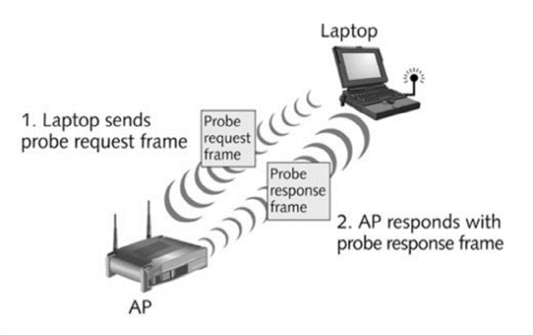
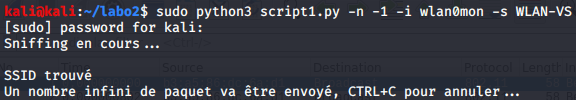
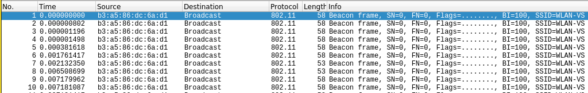
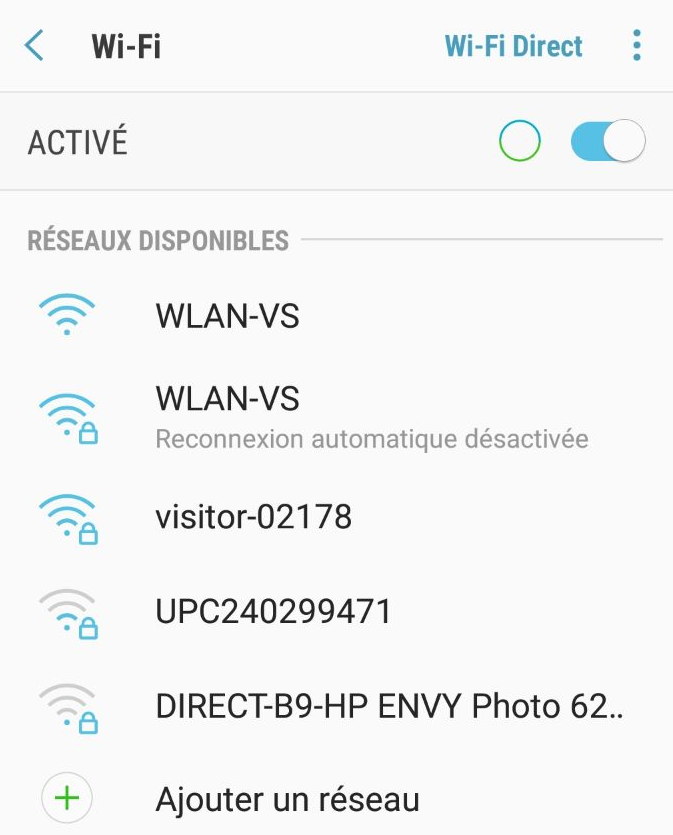
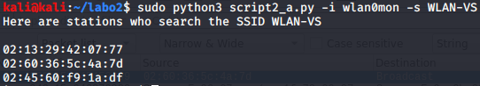
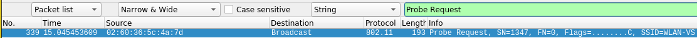
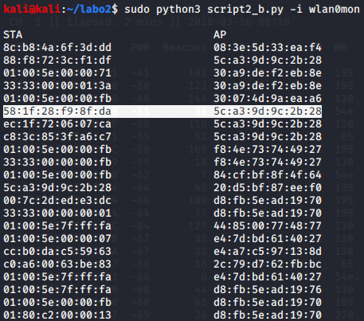
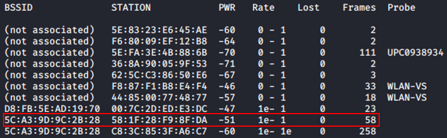
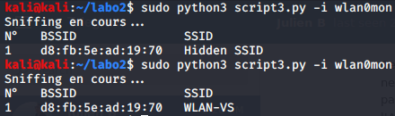

[Livrables](#livrables)

[Échéance](#échéance)

[Introduction](#introduction)

[Travail à réaliser](#travail-à-réaliser)

- [Sécurité des réseaux sans fil](#s%c3%a9curit%c3%a9-des-r%c3%a9seaux-sans-fil)
  - [Laboratoire 802.11 MAC 2](#laboratoire-80211-mac-2)
  - [Introduction](#introduction)
  - [Travail à réaliser](#travail-%c3%a0-r%c3%a9aliser)
    - [1. Probe Request Evil Twin Attack](#1-probe-request-evil-twin-attack)
    - [2. Détection de clients et réseaux](#2-d%c3%a9tection-de-clients-et-r%c3%a9seaux)
    - [3. Hidden SSID reveal](#3-hidden-ssid-reveal)
  - [Livrables](#livrables)
  - [Échéance](#%c3%89ch%c3%a9ance)

# Sécurité des réseaux sans fil

## Laboratoire 802.11 MAC 2

__A faire en équipes de deux personnes__

## Introduction

L’une des informations de plus intéressantes et utiles que l’on peut obtenir à partir d’un client sans fils de manière entièrement passive (et en clair) se trouve dans la trame ``Probe Request`` :



Dans ce type de trame, utilisée par les clients pour la recherche active de réseaux, on peut retrouver :

* L’adresse physique (MAC) du client (sauf pour dispositifs iOS 8 ou plus récents et des versions plus récentes d'Android). 
	* Utilisant l’adresse physique, on peut faire une hypothèse sur le constructeur du dispositif sans fils utilisé par la cible.
	* Elle peut aussi être utilisée pour identifier la présence de ce même dispositif à des différents endroits géographiques où l’on fait des captures, même si le client ne se connecte pas à un réseau sans fils.
* Des noms de réseaux (SSID) recherchés par le client.
	* Un Probe Request peut être utilisé pour « tracer » les pas d’un client. Si une trame Probe Request annonce le nom du réseau d’un hôtel en particulier, par exemple, ceci est une bonne indication que le client s’est déjà connecté au dit réseau. 
	* Un Probe Request peut être utilisé pour proposer un réseau « evil twin » à la cible.

Il peut être utile, pour des raisons entièrement légitimes et justifiables, de détecter si certains utilisateurs se trouvent dans les parages. Pensez, par exemple, au cas d'un incendie dans un bâtiment. On pourrait dresser une liste des dispositifs et la contraster avec les personnes qui ont déjà quitté le lieu.

A des fins plus discutables du point de vue éthique, la détection de client s'utilise également pour la recherche de marketing. Aux Etats Unis, par exemple, on "sniff" dans les couloirs de centres commerciaux pour détecter quelles vitrines attirent plus de visiteurs, et quelle marque de téléphone ils utilisent. Ce service, interconnecté en réseau, peut aussi déterminer si un client visite plusieurs centres commerciaux un même jour ou sur un certain intervalle de temps.

## Travail à réaliser

### 1. Probe Request Evil Twin Attack

Nous allons nous intéresser dans cet exercice à la création d'un evil twin pour viser une cible que l'on découvre dynamiquement utilisant des probes.

Développer un script en Python/Scapy capable de detecter une STA cherchant un SSID particulier - proposer un evil twin si le SSID est trouvé (i.e. McDonalds, Starbucks, etc.).

Pour la détection du SSID, vous devez utiliser Scapy. Pour proposer un evil twin, vous pouvez récupérer votre code du labo 1 ou vous servir d'un outil existant.

__Question__ : comment ça se fait que ces trames puissent être lues par tout le monde ? Ne serait-il pas plus judicieux de les chiffrer ?

Ces trames peuvent être lues par tout le monde car elles ne sont pas chiffrées. En revanche, le chiffrement n'est pas possible car pour que la station s'annonce auprès de l'AP pour un réseau spécifique, il faut que l'AP puisse accéder aux informations contenues dans la probe request reçue sans devoir posséder de clé de déchiffrement et par conséquent, y répondre via une probe response. 

__Question__ : pourquoi les dispositifs iOS et Android récents ne peuvent-ils plus être tracés avec cette méthode ?

La technique utilisée est la randomisation de la MAC adresse. En effet, comme le mentionne les deux sources ci-dessous, cela permet de préserver la confidentialité des utilisateurs en empêchant des potentiels "sniffeurs" de créer un historique complet de l'activité de l'appareil qui a été sniffé. 

Sources:

1) Android : https://source.android.com/devices/tech/connect/wifi-mac-randomization

2) IOS : https://9to5mac.com/2014/09/26/more-details-on-how-ios-8s-mac-address-randomization-feature-works-and-when-it-doesnt/

**Lancement et test**

Pour lancer le script, il suffit de spécifier le nombre de paquets qui seront envoyés pour le SSID cible, l'interface à utiliser et le SSID cible. Une fois lancé, le script va scanner les paquets pour trouver le SSID donné et lorsqu'il l'aura trouvé, il va générer un faux AP avec le même SSID donné. 

Ci-dessous, le lancement du script:



Ci-dessous, une capture wireshark où l'on observe l'envoie de paquets à l'infini avec le SSID donné:




Ci-dessous, une vue sur les 2 SSID proposés dont le premier est le faux et le second, le vrai: 




### 2. Détection de clients et réseaux

a) Développer un script en Python/Scapy capable de lister toutes les STA qui cherchent activement un SSID donné

**Lancement et test** 

Pour lancer le script, il suffit de spécifier l'interface à utiliser ainsi que le SSID cible. Puis, la liste des stations qui recherchent ce SSID s'affichera comme ci-dessous : 



Ci-dessous, nous pouvons voir une probe request avec comme source, une des stations qui se trouve dans la liste au dessus:




b) Développer un script en Python/Scapy capable de générer une liste d'AP visibles dans la salle et de STA détectés et déterminer quelle STA est associée à quel AP. Par exemple :

STAs &nbsp; &nbsp; &nbsp; &nbsp; &nbsp; &nbsp; &nbsp; &nbsp; &nbsp; &nbsp; &nbsp; &nbsp; &nbsp; &nbsp; &nbsp; &nbsp; &nbsp; &nbsp; &nbsp; APs

B8:17:C2:EB:8F:8F &nbsp; &nbsp; &nbsp; &nbsp; &nbsp; &nbsp; 08:EC:F5:28:1A:EF

9C:F3:87:34:3C:CB &nbsp; &nbsp; &nbsp; &nbsp; &nbsp; &nbsp; 00:6B:F1:50:48:3A

00:0E:35:C8:B8:66 &nbsp; &nbsp; &nbsp; &nbsp; &nbsp; &nbsp; 08:EC:F5:28:1A:EF


**Lancement et test** 

Pour lancer ce script, il suffit de renseigner l'interface à utiliser. Puis, une liste de stations ainsi que l'AP auquel elles sont associées s'affiche. Comme on peut le voir sur la première capture ci-dessous, la ligne entourée correspond bien à la ligne de la seconde capture






### 3. Hidden SSID reveal

Développer un script en Python/Scapy capable de reveler le SSID correspondant à un réseau configuré comme étant "invisible".

__Question__ : expliquer en quelques mots la solution que vous avez trouvée pour ce problème ?

Nous avons d’abord écouté chaque paquet beacon afin de récupérer les BSSIDs des paquets sans SSIDs, parallèlement nous avons écouté les Probes Responses afin de récupérer les SSIDs des paquets dont le BSSID correspondait au BSSID des paquets beacon.

**Lancement et test**

Pour lancer le script, il suffit de spécifier l'interface à utiliser. Dans la capture ci-dessous, nous lançons une première fois le script avec un réseau caché et nous l'obtenons sans pouvoir afficher son SSID. Puis, nous lançons une seconde fois et obtenons le SSID car une personne a tenté de se connecter à ce SSID et un échange de Probe Request/Response a eu lieu.



## Livrables

Un fork du repo original . Puis, un Pull Request contenant :

- Script evil twin __abondamment commenté/documenté__

- Scripts détection STA et AP __abondamment commenté/documenté__

- Script SSID reveal __abondamment commenté/documenté__

- Captures d'écran du fonctionnement de chaque script

-	Réponses aux éventuelles questions posées dans la donnée. Vous répondez aux questions dans votre ```README.md``` ou dans un pdf séparé

-	Envoyer le hash du commit et votre username GitHub par email au professeur et à l'assistant


## Échéance

Le 16 mars 2020 à 23h59
